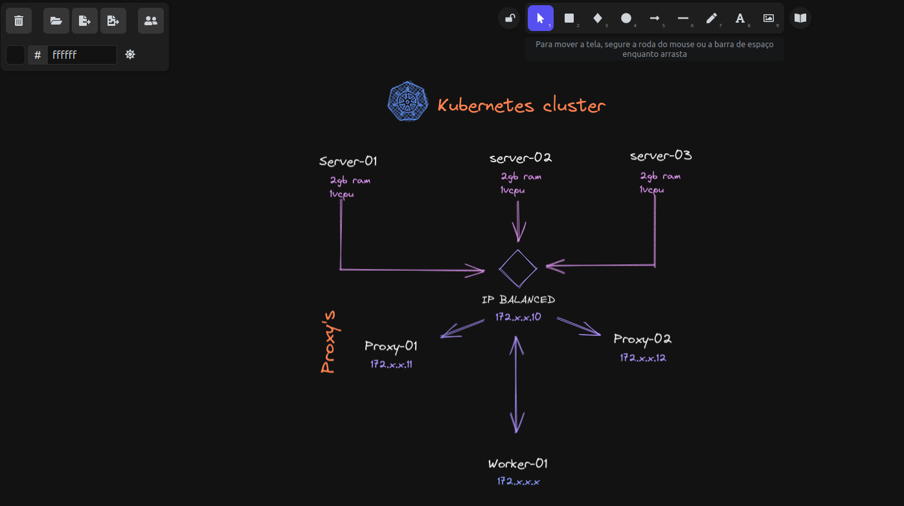

# EXCALIDRAW

## O que é ?

    O Excalidraw é mais uma ótima alternativa de ferramenta para utilização de quadro branco. 
    
    É gratuita, permite múltiplos usuários editando e visualizando e não exige nem a realização de login/cadastro.

## Como acessar ?

    https://excalidraw.com/

## Plugins ? Bibliotecas ? Ícones ?

    https://libraries.excalidraw.com/?target=_excalidraw&theme=light&sort=default

## Exemplos de mapas ?

